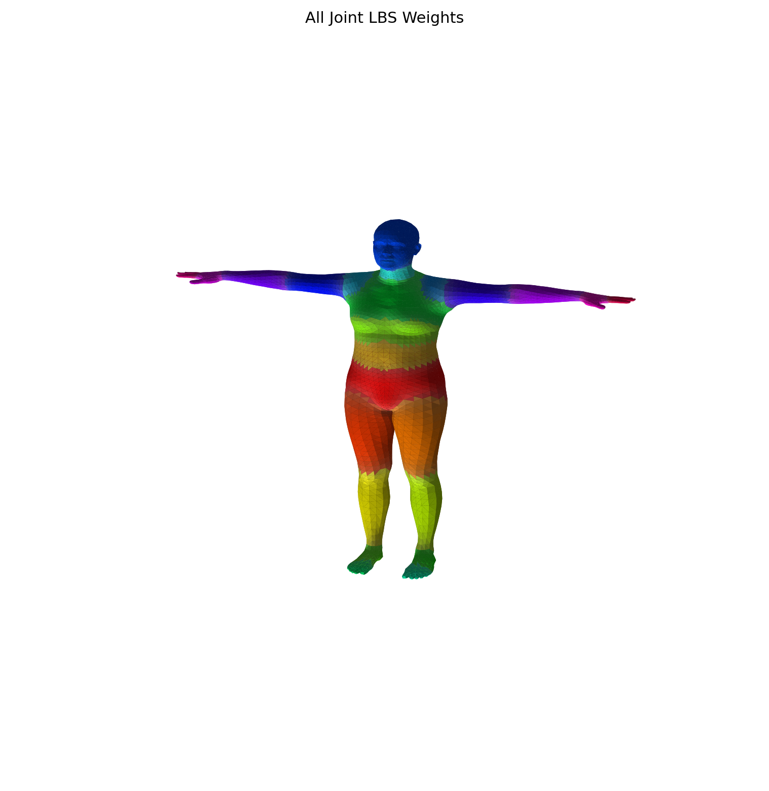
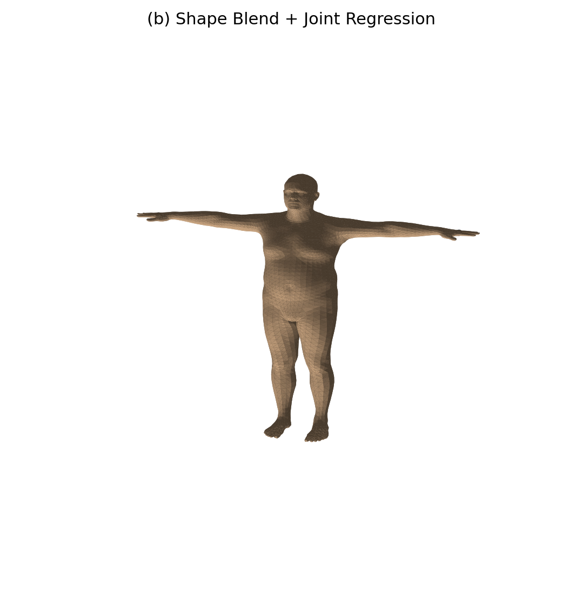
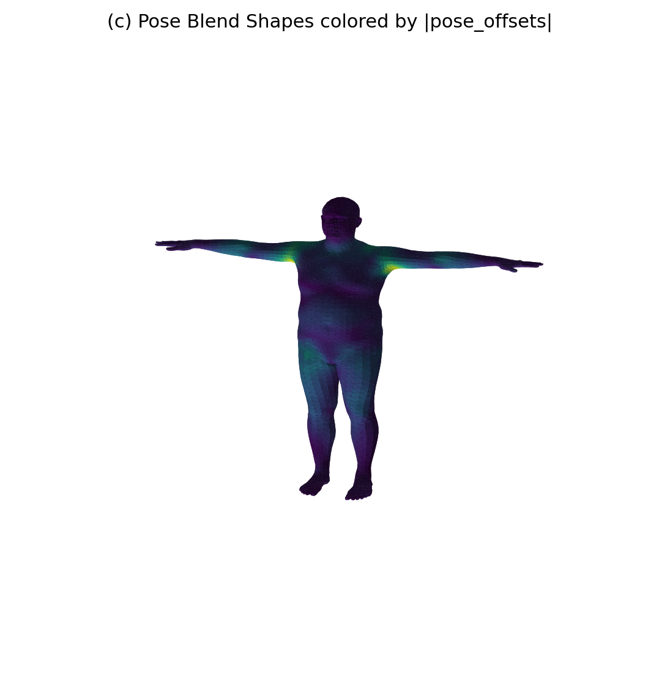
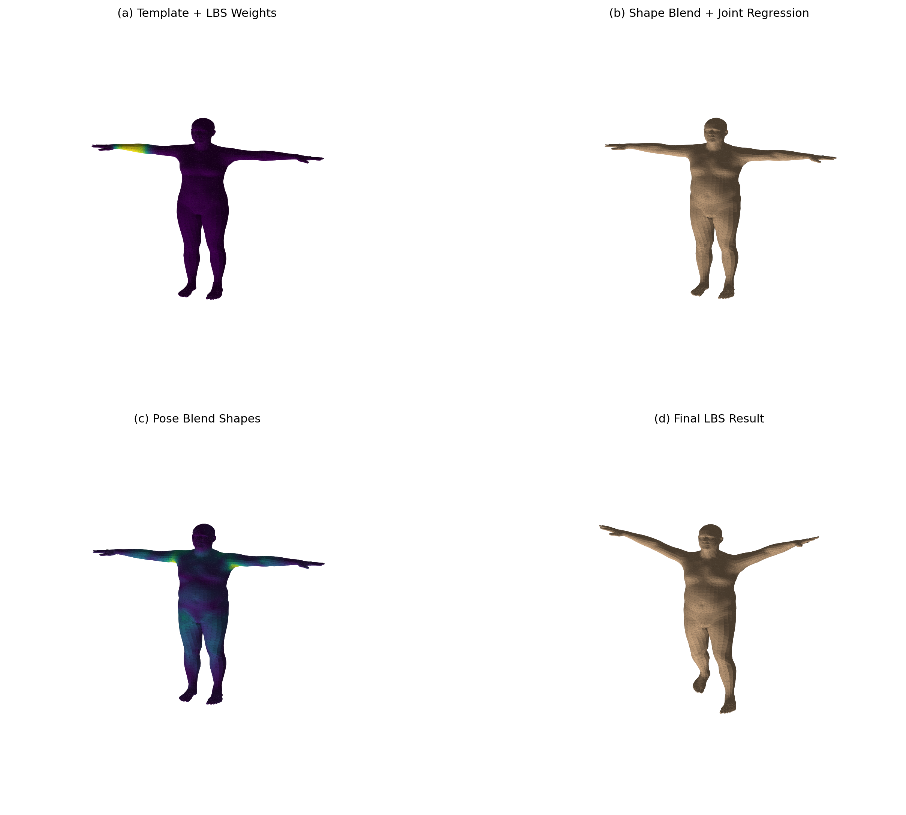

# 计算机图形学实验八：LBS 蒙皮

## 1. 实验名称

**实验八：LBS 蒙皮**

本实验基于 **SMPL 参数化人体模型**，完成一次完整的 **Linear Blend Skinning, LBS** 蒙皮过程可视化。实验通过手写复现 SMPL 官方 `lbs()` 中的关键计算流程，提取并可视化模板网格、形状校正、姿态校正、线性混合蒙皮等中间结果。

---

## 2. 实验目标

本实验的主要目标如下：

1. 理解参数化人体模型中模板网格、形状参数、姿态参数、关节回归器和蒙皮权重之间的关系。
2. 理解 LBS 的四个主要阶段：
   - **(a)** 模板网格 $$\bar{T}$$ 与蒙皮权重 $$\mathcal{W}$$；
   - **(b)** 形状校正后网格 $$\bar{T} + B_S(\beta)$$ 以及关节 $$J(\beta)$$；
   - **(c)** 姿态校正后网格 $$T_P(\beta,\theta)=\bar{T}+B_S(\beta)+B_P(\theta)$$；
   - **(d)** 经过 LBS 之后的最终姿态结果。
3. 学会调用 SMPL 模型，并将官方 `lbs()` 实现中的关键中间量单独提取出来进行可视化。
4. 验证手写 LBS 计算结果与 SMPL 官方 forward 输出结果的一致性。

---

## 3. 项目结构

```text
lab8_lbs_skinning/
├── README.md
├── requirements.txt
├── .gitignore
├── src/
│   └── lab8_lbs.py
├── models/
│   └── smpl/
│       └── SMPL_NEUTRAL.pkl
└── outputs/
    ├── stage_a_template_weights.png
    ├── stage_b_shaped_joints.png
    ├── stage_c_pose_offsets.png
    ├── stage_d_lbs_result.png
    ├── comparison_grid.png
    ├── all_joint_weights.png
    └── summary.txt
```

其中：

| 文件或目录 | 说明 |
|---|---|
| `src/lab8_lbs.py` | 实验八主程序，包含手写 LBS、可视化和误差验证 |
| `models/smpl/SMPL_NEUTRAL.pkl` | SMPL 中性人体模型文件，需要自行下载并放置 |
| `outputs/` | 程序运行后生成的实验结果图片与摘要文件 |
| `outputs/stage_a_template_weights.png` | 模板网格与单关节蒙皮权重热力图 |
| `outputs/stage_b_shaped_joints.png` | 形状校正后的网格与回归关节 |
| `outputs/stage_c_pose_offsets.png` | 姿态校正偏移量可视化 |
| `outputs/stage_d_lbs_result.png` | 最终 LBS 蒙皮结果 |
| `outputs/comparison_grid.png` | 四个阶段总对比图 |
| `outputs/all_joint_weights.png` | 全关节主导权重分布图 |
| `outputs/summary.txt` | 模型基础信息与手写 LBS 误差验证结果 |
| `requirements.txt` | Python 依赖列表 |
| `.gitignore` | 忽略虚拟环境、缓存、模型文件等不应提交的内容 |

---

## 4. 实验环境

本实验使用以下环境：

- Python 3.10 或以上
- PyTorch
- NumPy
- Matplotlib
- smplx

推荐使用虚拟环境运行：

```bash
python -m venv .venv
source .venv/bin/activate
```

Windows PowerShell 下可以使用：

```powershell
python -m venv .venv
.venv\Scripts\activate
```

然后安装依赖：

```bash
pip install -r requirements.txt
```

---

## 5. SMPL 模型文件准备

本实验需要使用 SMPL 模型文件：

```text
SMPL_NEUTRAL.pkl
```

请将模型文件放置到：

```text
models/smpl/SMPL_NEUTRAL.pkl
```

注意：SMPL 模型文件通常受协议限制，**不建议直接上传到公开 GitHub 仓库**。本仓库通过 `.gitignore` 忽略该文件，使用者需要自行下载并放入对应目录。

模型目录应类似：

```text
models/
└── smpl/
    └── SMPL_NEUTRAL.pkl
```

---

## 6. 实验原理

### 6.1 LBS 基本思想

LBS，即 Linear Blend Skinning，线性混合蒙皮，是计算机图形学和三维人体建模中常用的骨骼驱动网格变形方法。

对于一个顶点 $$v_i$$，它并不是只受一个关节控制，而是同时受到多个关节的影响。最终顶点位置由多个关节变换矩阵按照蒙皮权重加权得到：

$$
v_i' = \sum_{k=1}^{K} w_{ik} \, G_k(\theta, J(\beta)) \begin{bmatrix} v_i^{posed} \\ 1 \end{bmatrix}
$$

其中：

- $$v_i'$$ 是最终蒙皮后的顶点；
- $$w_{ik}$$ 是第 $$i$$ 个顶点受第 $$k$$ 个关节影响的权重；
- $$G_k$$ 是第 $$k$$ 个关节的全局刚体变换；
- $$v_i^{posed}$$ 是经过形状校正和姿态校正后的顶点；
- $$K$$ 是关节数量。

---

### 6.2 阶段一：模板网格与蒙皮权重

SMPL 模型的初始网格为模板人体网格：

$$
\bar{T}
$$

通常处于 T-pose 状态。每个顶点还带有一组蒙皮权重：

$$
\mathcal{W}
$$

蒙皮权重描述该顶点受到各个关节影响的程度。靠近手臂的顶点通常更多受到肩、肘、腕等关节影响；靠近腿部的顶点则更多受到髋、膝、踝等关节影响。

在代码中对应：

```python
v_template = model.v_template
lbs_weights = model.lbs_weights
```

---

### 6.3 阶段二：形状校正与关节回归

SMPL 使用形状参数 $$\beta$$ 控制人体体型，例如高矮、胖瘦、肩宽、腿长等。形状校正后的顶点为：

$$
T_{shape} = \bar{T} + B_S(\beta)
$$

代码中对应：

```python
v_shaped = v_template + blend_shapes(betas, shapedirs)
```

关节位置并不是固定常数，而是由形状变化后的网格通过关节回归器得到：

$$
J(\beta) = \mathcal{J}(T_{shape})
$$

代码中对应：

```python
J = vertices2joints(model.J_regressor, v_shaped)
```

这样可以保证不同体型的人体模型具有合理的关节位置。

---

### 6.4 阶段三：姿态校正

仅使用骨骼旋转对网格进行刚体变换，容易在肩膀、肘部、膝盖等弯曲区域产生不自然的变形。因此 SMPL 在真正进行 LBS 之前，会添加姿态相关校正项：

$$
T_P(\beta,\theta) = \bar{T}+B_S(\beta)+B_P(\theta)
$$

具体做法是先将轴角姿态转换为旋转矩阵，然后构造姿态特征：

$$
pose\_feature = R(\theta) - I
$$

再通过 `posedirs` 得到姿态偏移：

```python
rot_mats = batch_rodrigues(full_pose.view(-1, 3)).view(1, -1, 3, 3)
pose_feature = (rot_mats[:, 1:, :, :] - ident).view(1, -1)
pose_offsets = torch.matmul(pose_feature, posedirs).view(1, -1, 3)
v_posed = v_shaped + pose_offsets
```

这一步得到的 `v_posed` 仍然不是最终姿态，只是加入了姿态相关的局部几何修正。

---

### 6.5 阶段四：线性混合蒙皮

在最终 LBS 阶段，需要根据运动学树计算每个关节的全局刚体变换：

```python
J_transformed, A = batch_rigid_transform(rot_mats, J, model.parents, dtype=dtype)
```

然后使用蒙皮权重对关节变换进行加权：

```python
W = model.lbs_weights.unsqueeze(0).expand(1, -1, -1)
T = torch.matmul(W, A.view(1, num_joints, 16)).view(1, -1, 4, 4)
```

最后将加权后的变换作用于姿态校正后的顶点：

```python
v_posed_homo = torch.cat([v_posed, homogen_coord], dim=2)
v_homo = torch.matmul(T, v_posed_homo.unsqueeze(-1))
verts = v_homo[:, :, :3, 0]
```

其中 `verts` 就是最终完成 LBS 之后的人体网格顶点。

---

## 7. 核心变量说明

本实验在代码中明确区分以下五个核心对象：

| 变量 | 含义 |
|---|---|
| `v_template` | SMPL 模板网格顶点，通常为 T-pose |
| `v_shaped` | 加入形状参数后的顶点 |
| `J` / `J_shaped` | 由 `v_shaped` 通过关节回归器得到的关节 |
| `v_posed` | 加入姿态校正项后的顶点 |
| `verts` | 完成 LBS 后的最终顶点 |

这五个变量对应 LBS 从模板网格到最终姿态结果的完整流程。

---

## 8. 运行方式

### 8.1 安装依赖

```bash
pip install -r requirements.txt
```

### 8.2 放置模型文件

将 `SMPL_NEUTRAL.pkl` 放入：

```text
models/smpl/SMPL_NEUTRAL.pkl
```

### 8.3 运行实验

在项目根目录下执行：

```bash
python src/lab8_lbs.py --model-dir ./models --out-dir ./outputs --joint-id 18 --num-betas 10
```

参数说明：

| 参数 | 默认值 | 说明 |
|---|---|---|
| `--model-dir` | `./models` | SMPL 模型所在目录 |
| `--out-dir` | `./outputs` | 输出结果目录 |
| `--joint-id` | `18` | 单关节权重热力图中要可视化的关节编号 |
| `--num-betas` | `10` | 使用的 shape 参数数量 |

运行成功后，会在 `outputs/` 下生成所有实验结果。

---

## 9. 实验结果展示

### 9.1 阶段一：模板网格与蒙皮权重

该图展示了 SMPL 模板人体网格，以及指定关节对所有顶点的影响权重。颜色越明显，表示该关节对该区域的影响越强。


---

### 9.2 全关节主导权重分布图

该图展示了人体表面不同区域主要由哪些关节控制。每个面片根据主导影响关节分配颜色，颜色种类表示主导关节，颜色强弱表示主导权重大小。



---

### 9.3 阶段二：形状校正与关节回归

该图展示了加入非零 shape 参数后的 `v_shaped` 网格，并叠加显示由关节回归器计算出的关节点。



从结果可以看出，人体体型发生变化后，关节点仍然位于身体内部较合理的位置。这说明 SMPL 的关节位置与人体形状相关，而不是固定不变的常数。

---

### 9.4 阶段三：姿态校正可视化

该图展示了姿态校正偏移量 `pose_offsets` 的大小。颜色越明显，说明该区域受到姿态相关校正的影响越大。



姿态校正主要出现在肩膀、肘部、髋部、膝盖等容易发生弯曲的区域。

---

### 9.5 阶段四：最终 LBS 蒙皮结果

该图展示了经过 LBS 后的最终人体姿态，同时叠加显示变换后的关节点。


最终结果表明，人体网格已经根据给定姿态参数完成了骨骼驱动变形。

---

### 9.6 四阶段总对比图

下图将 LBS 的四个阶段放在同一张图中，分别为：

- **(a)** template + weights
- **(b)** shape + joints
- **(c)** pose offsets
- **(d)** final skinned mesh



该图可以直观展示从模板网格到最终蒙皮结果的完整变化过程。

---

## 10. 手写 LBS 与官方 forward 一致性验证

实验中使用与手写实现完全相同的：

- `betas`
- `global_orient`
- `body_pose`

调用官方 SMPL forward：

```python
output = model(
    betas=betas,
    global_orient=global_orient,
    body_pose=body_pose,
    return_verts=True,
)
```

然后将手写 LBS 得到的 `verts` 与官方输出 `output.vertices` 逐顶点比较，计算：

- 平均绝对误差；
- 最大绝对误差。

误差结果保存在：

```text
outputs/summary.txt
```

示例内容如下：

```text
===== SMPL LBS Lab Summary =====
num_vertices: 6890
num_faces: 13776
num_joints(from lbs_weights): 24
num_betas: 10
visualized_joint_id: 18
manual_vs_official_mean_abs_error: 0.0000000000
manual_vs_official_max_abs_error: 0.0000000000
```

若误差接近 0，说明手写 LBS 实现与官方 SMPL forward 结果一致。

---

## 11. 思考题回答

### 11.1 为什么一个顶点不只受一个关节影响？

人体表面是连续的。如果每个顶点只受一个关节控制，那么在关节交界处会出现明显断裂或硬折痕。例如肘部、膝盖、肩部等区域在运动时需要平滑过渡，因此一个顶点通常会同时受到多个关节影响。

---

### 11.2 如果一个顶点的权重几乎全给某一个关节，会出现什么效果？

如果某个顶点的权重几乎全部集中在一个关节上，那么该顶点会近似刚性地跟随这个关节运动。这种情况适合远离关节弯曲区域的部位，例如前臂中部、小腿中部等。

---

### 11.3 如果权重分布很平均，会出现什么效果？

如果一个顶点对多个关节的权重过于平均，那么它会受到多个关节变换的混合影响，运动可能变得过于平滑甚至不够稳定。在某些区域可能出现不自然的拉伸或塌陷。

---

### 11.4 为什么关节位置要从形状后的网格回归，而不是固定不变？

不同体型的人体具有不同的骨架比例和关节位置。例如高矮、胖瘦、肩宽、腿长都会影响肩、髋、膝等关节的大致位置。如果关节固定不变，就无法适应不同体型的人体模型，最终蒙皮结果会不自然。

---

### 11.5 如果人物变胖或变瘦，肩、膝、髋等关节位置会不会变化？

会变化。虽然关节拓扑结构不变，但关节在三维空间中的具体位置会随着人体形状发生调整。因此 SMPL 通过 `J_regressor` 从 `v_shaped` 中回归关节位置。

---

### 11.6 `v_template` 与 `v_shaped` 的差别是什么？

`v_template` 是 SMPL 的平均模板人体网格，通常表示标准体型。`v_shaped` 是在 `v_template` 基础上加入形状参数 $$\beta$$ 后得到的网格，体现了具体人物的体型差异。

---

### 11.7 为什么 LBS 之前还要加 pose corrective？

单纯使用骨骼刚体变换很难表达人体关节弯曲时产生的局部肌肉和皮肤变化。例如肩部抬起、肘部弯曲、膝盖弯曲时，皮肤表面会发生额外形变。pose corrective 可以补偿这些非刚体变化，使结果更自然。

---

### 11.8 如果去掉 `pose_offsets`，最终人体弯曲处会出现什么问题？

如果去掉 `pose_offsets`，肩膀、肘部、膝盖等区域可能出现塌陷、穿插、异常拉伸或体积损失等问题。最终人体姿态会显得比较僵硬，不够真实。

---

### 11.9 `v_shaped` 与 `v_posed` 的本质区别是什么？

`v_shaped` 只包含人体体型变化，由 shape 参数 $$\beta$$ 控制。`v_posed` 在 `v_shaped` 的基础上进一步加入了姿态相关校正 $$B_P(\theta)$$，用于修正特定姿态下的局部几何变化。

---

### 11.10 `J` 和 `J_transformed` 有什么区别？

`J` 是根据 `v_shaped` 回归得到的关节位置，通常处于未经过姿态变换的形状空间中。`J_transformed` 是经过运动学链和姿态变换后的关节位置，表示最终姿态下的关节点位置。

---

### 11.11 为什么最终顶点要写成加权和，而不是只选择最大权重的关节？

如果只选择最大权重的关节，人体表面会产生分段刚性变形，关节连接区域会出现明显断裂或折痕。使用加权和可以让相邻骨骼之间平滑过渡，使皮肤变形更加连续自然。

---

## 12. 实验总结

本实验基于 SMPL 模型完整实现并可视化了 LBS 蒙皮流程。实验从模板网格出发，依次完成了蒙皮权重可视化、形状校正、关节回归、姿态校正和最终线性混合蒙皮。

通过本实验可以更加清楚地理解 SMPL 模型中模板网格、形状参数、姿态参数、关节回归器、姿态修正项和蒙皮权重之间的关系。同时，通过将手写 LBS 结果与官方 forward 输出进行误差比较，也验证了实验实现的正确性。

本实验为后续学习三维人体建模、骨骼动画、角色绑定、人体姿态估计和神经人体渲染等内容打下了基础。
